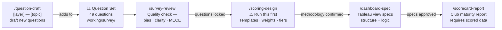
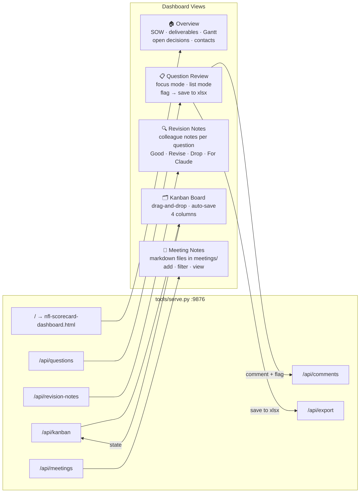
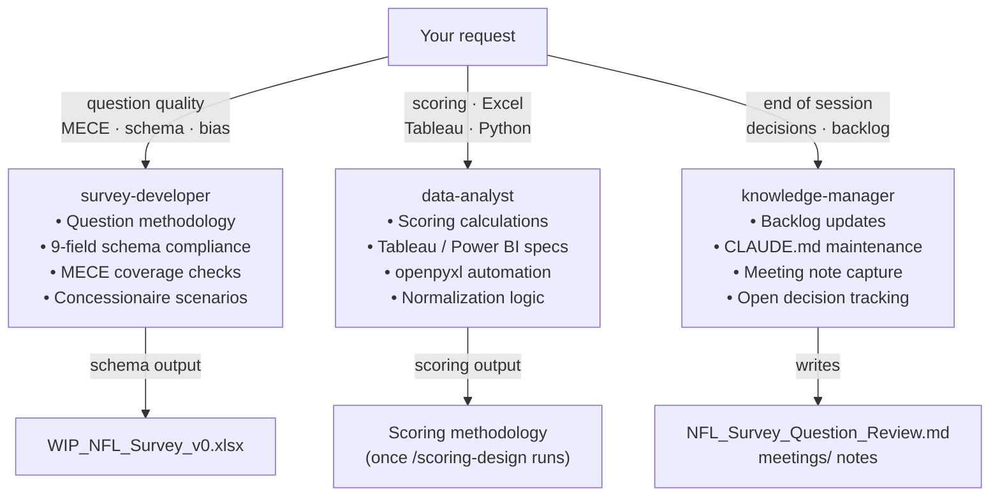
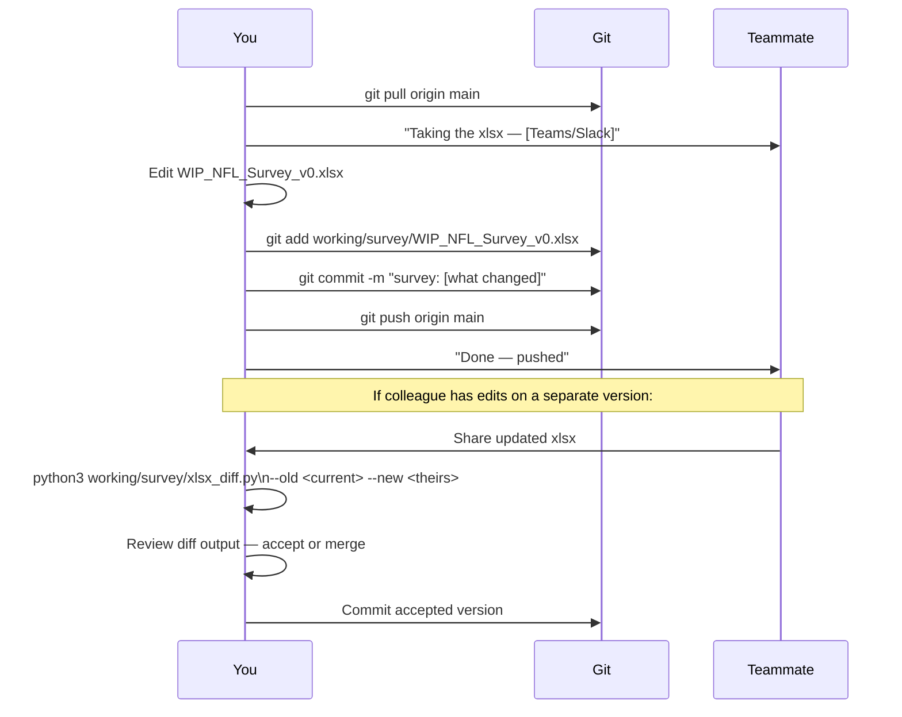
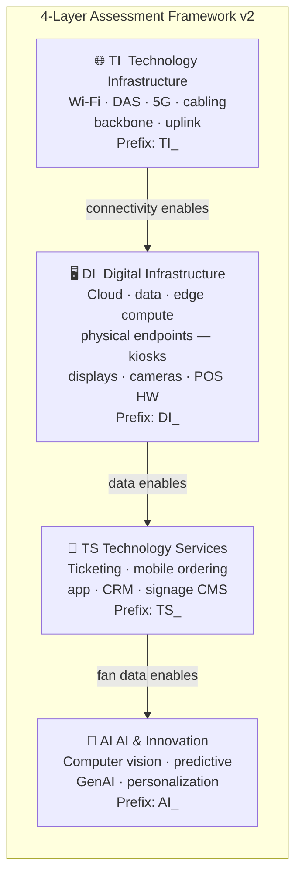
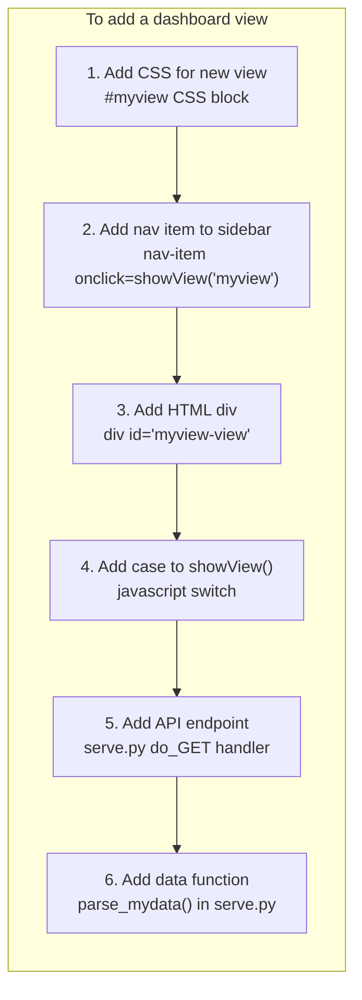

# NFL Stadium Technology Scorecard

> Accenture × NFL | ISOW 8, Phase 2 | $100K fixed fee | 4-club pilot → 32-club program

Stadium technology maturity assessment framework for NFL venues. Survey instrument, scoring methodology, and Tableau dashboard for benchmarking club technology capability across fan experience, operations, and innovation.

**Client:** Gary Brantley (NFL SVP & CIO) | **Accenture lead:** Jon Wakefield (Principal)

---

## Ecosystem Overview

```mermaid
graph TB
    subgraph Repo["📁 RT3-ACN/nfl-scorecard"]
        xlsx["📊 WIP_NFL_Survey_v0.xlsx\n49 questions · 4 layers"]
        meetings_dir["📅 meetings/\nmarkdown meeting notes"]
        kanban_json["📌 kanban-state.json"]
        claude_md["📋 CLAUDE.md\nautomatically loaded context"]
    end

    subgraph ClaudeCode["🤖 Claude Code — .claude/"]
        subgraph Skills["Skills  (slash commands)"]
            sr["/survey-review"]
            qd["/question-draft"]
            sd["/scoring-design"]
            ds["/dashboard-spec"]
            scr["/scorecard-report"]
        end
        subgraph Agents["Agents  (auto-routed)"]
            dev["survey-developer\nquestion methodology"]
            da["data-analyst\nscoring + Tableau"]
            km["knowledge-manager\nbacklog + CLAUDE.md"]
        end
    end

    subgraph Dashboard["🖥️ Dashboard  localhost:9876"]
        ov["Overview\nSOW · Gantt · contacts"]
        rev["Question Review\nflag · comment · export"]
        rn["Revision Notes\ncolleague review notes"]
        board["Kanban Board\nteam task tracking"]
        mtg_tab["Meeting Notes\nall sessions"]
    end

    subgraph Deliverables["📤 Deliverables"]
        pptx["NFL Walkaround.pptx\nA: Framework"]
        report["Scorecard Report\nD: Club maturity"]
        tableau["Tableau Dashboard\nC: Benchmarks"]
    end

    claude_md -->|loads at startup| ClaudeCode
    xlsx -->|questions API| rev
    xlsx -->|revision notes API| rn
    meetings_dir -->|meetings API| mtg_tab
    kanban_json -->|kanban API| board

    sr -->|quality checks| xlsx
    qd -->|drafts into| xlsx
    sd -->|calls| da
    ds -->|generates spec for| tableau
    scr -->|generates| report
    km -->|updates| meetings_dir
    km -->|updates| claude_md
```



---

## Skill Pipeline — The Critical Path

Skills must be run **in order**. Nothing downstream works without the step before it.



> **Where we are:** Questions under revision → scoring not yet designed → dashboard blocked

---

## Dashboard Architecture

Everything runs from a single server (`python3 tools/serve.py`). The dashboard is the home page at `localhost:9876`.



---

## Agent Routing — When Claude Uses Which Agent



---

## Collaboration Workflow — Editing the Excel Without Conflicts

Git cannot merge binary Excel files. Follow this pattern every time.



**Quick diff command:**
```bash
python3 working/survey/xlsx_diff.py \
  --old working/survey/WIP_NFL_Survey_v0.xlsx \
  --new ~/Downloads/WIP_NFL_Survey.xlsx
```

---

## Framework — v2 (locked 2026-03-18)



> **Critical rule:** Physical endpoint devices (kiosks, displays, cameras, POS hardware) → `DI_`, not `TI_`. `TI_` = connectivity infrastructure only.

---

## Project Dashboard

The project runs a local dashboard at **http://localhost:9876** with five tabs:

| Tab | What it does |
|-----|-------------|
| **Overview** | SOW status, deliverables tracker, Gantt, contacts, open decisions |
| **Board** | Kanban — drag cards across Backlog → In Progress → In Review → Done |
| **Question Review** | Flag, comment, and export all 49 survey questions |
| **Revision Notes** | Browse colleague's scoring review notes — filter by Good / Revise / Drop / For Claude |
| **Meeting Notes** | All project meetings with type tags + add new notes |

### Starting the Dashboard

#### With Claude Code (recommended)

```
Start the project dashboard
```

Claude runs the server and your browser opens automatically.

#### Manually

```bash
python3 tools/serve.py
```

Press `Ctrl+C` to stop.

**Requirement:** Python 3 + `openpyxl`
```bash
pip install openpyxl
```

---

## Where We Are

| Phase | Status |
|-------|--------|
| 1. Survey questions | 🔄 In revision — 49 questions, fix DI_3/DI_5/TS_3, finalize by ~Mar 31 |
| 2. Scoring methodology | ⏳ Not started — use `/scoring-design` once questions are locked |
| 3. Tableau / Power BI dashboard | ⏸ Blocked on scoring — platform TBD |
| 4. Pilot deployment (4 clubs) | ⏸ Blocked on survey + scoring |

**Pilot clubs:** Arizona Cardinals · Denver Broncos · third TBD (Bears or Buccaneers)

**The work right now is questions.** Fix DI_3 (normalization), DI_5 (non-response), TS_3 (concessionaire), address colleague's revision notes, then run `/scoring-design`.

---

## Setup

### Prerequisites
- [Claude Code](https://claude.ai/claude-code) installed and licensed
- Git + GitHub collaborator access (request from Robert)
- Python 3 + `openpyxl` (`pip install openpyxl`)

### 3 steps

**1. Clone**
```bash
git clone https://github.com/RT3-ACN/nfl-scorecard.git
cd nfl-scorecard
```

**2. Install the pre-push hook (one-time)**
```bash
git config core.hooksPath .githooks
```

**3. Open Claude Code from the repo root**
```bash
claude .
```

**Verify Claude has context:**
> *"What's the current state of the project — active question set, known issues, and what phase are we in?"*

Expected: v2 4-layer framework, 49 questions in `WIP_NFL_Survey_v0.xlsx`, 3 known critical issues, scoring not yet designed.

---

## What Claude Can Do

| Command | When to use |
|---------|-------------|
| `/survey-review` | Quality check all questions — run before any pilot deployment |
| `/survey-review — focus on [layer]` | Review a specific layer (TI / DI / TS / AI) |
| `/question-draft [layer] — [topic]` | Draft a new question in the correct 9-field schema |
| `/scoring-design` | **Start here for scoring** — builds methodology from the question set |
| `/dashboard-spec [view name]` | Design Tableau dashboard views (structure only until scoring is finalized) |
| `/scorecard-report [Club Name]` | Generate a club maturity report (requires scored survey data) |

**Right sequence:** questions locked → `/scoring-design` → `/dashboard-spec` → `/scorecard-report`

---

## Improving the Tooling

### Adding or editing a skill

Skills live in `.claude/skills/`. Each skill is a folder with a markdown file that Claude reads as a prompt template.

```
.claude/skills/
├── survey-review/      ← /survey-review
├── question-draft/     ← /question-draft
├── scoring-design/     ← /scoring-design
├── dashboard-spec/     ← /dashboard-spec
└── scorecard-report/   ← /scorecard-report
```

**To add a skill:** Create a new folder under `.claude/skills/`, add a prompt file, then register it in `plugin.json` under `"skills"`. Follow the quality standard in [CONTRIBUTING.md](CONTRIBUTING.md).

**To edit a skill:** Read the current file in full first. Understand why it's written the way it is. Show a before/after diff in your PR — skill description changes affect when Claude invokes it automatically.

### Adding or editing an agent

Agents live in `.claude/agents/` as markdown files. Each defines a role, model tier, tools, and behavior.

```
.claude/agents/
├── survey-developer.md   ← question methodology + schema compliance
├── data-analyst.md       ← scoring + Tableau + Python/Excel
└── knowledge-manager.md  ← backlog + CLAUDE.md + meeting notes
```

**To add an agent:** Create a `.md` file in `.claude/agents/` with a clear role, trigger conditions, and output contract. Register in `plugin.json` under `"agents"`.

### Editing the dashboard

The dashboard is a single HTML file: `deliverables/nfl-scorecard-dashboard.html`. The server is `tools/serve.py`.



**To add a data source:** Add a `parse_*()` function in `serve.py` and a `/api/route` in `do_GET`. Keep the existing `_q_cache` pattern for file-backed data.

### Editing the xlsx diff tool

`working/survey/xlsx_diff.py` compares any two xlsx versions question-by-question. Add fields to `COMPARE_FIELDS` to include them in diffs. Add fields to `NEW_ONLY_FIELDS` to surface columns that only exist in the new version.

---

## First Session Pattern

Start every session:
```
Check the backlog and tell me: what are the 3 critical issues, what's been
decided, and what are the open decisions?
```

End every session:
```
We decided [X] today. Update the backlog and tell me if CLAUDE.md needs changing.
```

Commit via branch:
```bash
git checkout -b survey/[what-changed]
git add working/ meetings/
git commit -m "survey: [what changed]"
git push -u origin survey/[what-changed]
gh pr create
```

---

## Repository Structure

```
nfl-scorecard/
│
├── CLAUDE.md                         ← Claude's context (loads automatically)
├── CONTRIBUTING.md                   ← Team workflow + tooling quality standards
├── TEAM_GUIDE.md                     ← OneDrive sync + Claude Code setup for teammates
├── plugin.json                       ← Claude Code plugin manifest
│
├── tools/
│   ├── serve.py                      ← Dashboard server (python3 tools/serve.py)
│   ├── review.html                   ← Standalone question review (legacy)
│   ├── kanban.html                   ← Standalone kanban (legacy)
│   ├── changes.html                  ← Revision notes viewer (embedded in dashboard)
│   └── kanban-state.json             ← Kanban board state (auto-saved)
│
├── meetings/                         ← All project meeting notes (markdown)
│   └── YYYY-MM-DD-title.md
│
├── deliverables/
│   └── nfl-scorecard-dashboard.html  ← Main project dashboard (served at localhost:9876)
│
├── docs/
│   ├── onboarding.md
│   ├── claude-guide.md
│   ├── framework.md
│   ├── skills-reference.md
│   ├── agents-reference.md
│   └── workflow.md
│
├── .claude/
│   ├── agents/                       ← survey-developer · data-analyst · knowledge-manager
│   ├── skills/                       ← /survey-review · /question-draft · /scoring-design · etc.
│   └── rules/                        ← Conditional context (plugin-dev, survey-work)
│
├── working/
│   └── survey/
│       ├── WIP_NFL_Survey_v0.xlsx    ← Active question set (49 questions, 2 sheets)
│       ├── xlsx_diff.py              ← Diff tool for comparing xlsx versions
│       └── nfl_review_comments.json  ← Question Review saved comments
│
├── reference/                        ← Stable docs (VOF research, tech definitions)
└── archive/                          ← Superseded files — move here, never delete
```

---

## Survey Milestones

- [x] v2 framework locked — 4 layers (TI/DI/TS/AI)
- [x] 49 Claude V0 questions drafted and reviewed by colleague
- [x] Question Review tool — localhost:9876 Question Review tab
- [x] Revision Notes tool — colleague scoring notes surfaced per question
- [x] xlsx_diff.py — version diff tool for safe Excel collaboration
- [x] Meeting notes workflow — all sessions captured
- [ ] Fix 3 critical issues: DI_3 (normalization), DI_5 (non-response), TS_3 (concessionaire)
- [ ] Address colleague revision notes — 4 drops · 8 revisions · 4 For Claude tasks
- [ ] Final question set confirmed with Jon Wakefield
- [ ] Run `/scoring-design` — assign templates, dimensions, weights, tier thresholds
- [ ] Scoring methodology confirmed
- [ ] Tableau / Power BI platform decision
- [ ] Pilot deployment to 4 clubs (Cardinals, Broncos, TBD)

---

## 5 Rules That Matter Most

1. **`WIP_NFL_Survey_v0.xlsx` is the only working Excel in the repo** — all other workbooks are retired
2. **Scoring methodology is not designed yet** — never apply pitch-era weights or formulas; use `/scoring-design`
3. **Physical endpoints (kiosks, displays, cameras, POS hardware) → `DI_`**, not `TI_`
4. **Absolute counts are not comparable** across 32 clubs — always normalize per 10K seats
5. **Survey is tech-focused only** — no business/marketing questions (Jon Noble hard requirement)

---

## Documentation

| Doc | Read when |
|-----|-----------|
| [docs/onboarding.md](docs/onboarding.md) | Day one setup + orientation |
| [docs/claude-guide.md](docs/claude-guide.md) | Using Claude effectively on this project |
| [docs/framework.md](docs/framework.md) | v2 4-layer framework deep reference |
| [docs/skills-reference.md](docs/skills-reference.md) | All slash commands with examples |
| [docs/agents-reference.md](docs/agents-reference.md) | Which agent to use for what |
| [docs/workflow.md](docs/workflow.md) | Daily git + work patterns |
| [CONTRIBUTING.md](CONTRIBUTING.md) | Improving agents, skills, and tooling |

---

*Accenture/NFL client engagement. RT3-ACN org — collaborator access required to contribute.*
